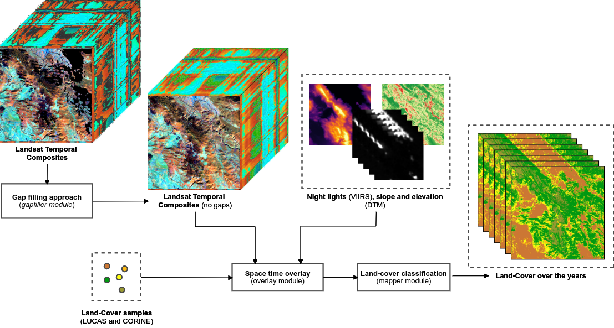
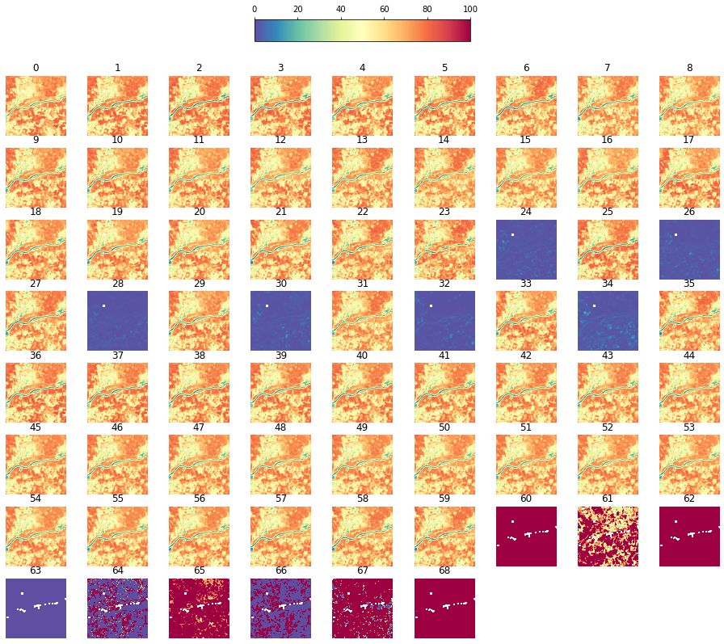

===========
[](./LICENSE)

<!--- Add small benchmark dataset in zenodo
[](http://doi.org/10.5281/zenodo.4058447)
-->
<!---
[Community](https://opendatascience.eu) |
[Documentation](https://eumap.readthedocs.org) |
[Resources](demo/README.md) |
[Release Notes](NEWS.md)
-->

`scikit-map` is a Python module to produce maps using machine learning, reference samples and raster data. It is fully compatible with [scikit-learn](https://github.com/openlandmap/scikit-learn) and distributed under the MIT license. 

The project was started in 2020 by [GeoHarmonizer](https://opendatascience.eu/geoharmonizer-project/) and originally called [`eumap`](https://gitlab.com/geoharmonizer_inea/eumap). In 2023, `eumap` was archived and the codebase moved to this repository.

Main functionalities
-------



`scikit-map` implements:
- Parallel raster reading and writing 
- Spatial and time-series gapfilling
- Space and spacetime overlay 
- ML training, evaluation and spatial prediction
- Parallel tilling processing 

## Raster data processing

Example of NDVI quarterly time-series processing: 

```python
from skmap.data import toy
from skmap.io import process

# Loading NDVI quarterly time-series with gaps
toy.ndvi_rdata(gappy=True 
    # Gapfilling time-series by seasonal convolution 
    ).run(process.SeasConvFill(season_size=4), drop_input=True
    # Smoothing time-series by Whittaker
    ).run(process.WhittakerSmooth(), group='ndvi.seasconv', drop_input=True
    # Setting smoothed time-series as main input
    ).rename(groups={'ndvi.seasconv.whittaker': 'ndvi'}
    # Running yearly aggregation by std. and percentile 50th
    ).run(process.TimeAggregate(time=[process.TimeEnum.YEARLY], operations = ['p50', 'std']), group=['ndvi']
    # Running trend analysis using per-pixel linear regression  
    ).run(process.TrendAnalysis(season_size=4), group='ndvi'
    # Ploting all raster data
    ).plot(v_minmax=[0,100])
```

Output in `verbose` mode:
```
[20:57:02] RasterData with 24 rasters and 1 groups
[20:57:02] Reading 24 raster file(s) using 4 workers
[20:57:07] Read array shape: (256, 256, 24)
[20:57:07] Running SeasConvFill on (256, 256, 24) for ndvi group
[20:57:07] Dropping data and info for ndvi group
[20:57:07] Execution time for SeasConvFill: 0.15 segs
[20:57:07] Running WhittakerSmooth on (256, 256, 24) for ndvi.seasconv group
[20:57:15] Dropping data and info for ndvi.seasconv group
[20:57:15] Execution time for WhittakerSmooth: 8.07 segs
[20:57:15] Running TimeAggregate on (256, 256, 24) for ndvi group
[20:57:15] Execution time for TimeAggregate: 0.12 segs
[20:57:15] Running TrendAnalysis on (256, 256, 24) for ndvi group
[20:57:24] Execution time for TrendAnalysis: 8.69 segs
```



Installation
-------

**Dependencies**

`scikit-map` requires:

- Python (>= 3.7)
- Scikit-learn(>= 1.0)
- NumPy (>= 1.19)
- Rasterio (>= 1.1)
- Pandas (>= 2.0)
- Geopandas (>= 0.13)
- joblib (>= 1.1.1)

If you already have a working installation of `gdal`, `scikit-learn` and `numpy`, you can install `scikit-map` is using pip:

```bash
pip install -e 'git+https://github.com/openlandmap/scikit-map#egg=scikit-map[full]'
```

License
-------
© Contributors, 2023. Licensed under an [MIT License](LICENSE).

Contributing
---------------------
To learn more about making a contribution to scikit-learn, please see our [Contributing guide](CONTRIBUTING.md).

Acknowledgements & Funding
--------

This work is supported by [OpenGeoHub Foundation](https://opengeohub.org/) and [MultiOne](https://multione.hr/) and has received funding from European Comission (EC) through the projects:

- [AI4SoilHealth](https://ai4soilhealth.eu/): Accelerating collection and use of soil health information using AI technology to support the Soil Deal for Europe and EU Soil Observatory (1 Jan. 2023 – 31 Dec. 2026 - [101086179](https://cordis.europa.eu/project/id/101086179))
- [Open-Earth-Monitor Cyberinfrastructure](https://earthmonitor.org/): Environmental information to support EU’s Green Deal (1 Jun. 2022 – 31 May 2026 - [101059548](https://cordis.europa.eu/project/id/101059548))
- [Geo-harmonizer](https://opendatascience.eu/geoharmonizer-project/): EU-wide automated mapping system for harmonization of Open Data based on FOSS4G and Machine Learning (Sep. 2019 – Jul. 2022 -[CEF-TC-2018-5](https://hadea.ec.europa.eu/calls-proposals/2018-cef-telecom-call-public-open-data-cef-tc-2018-5_en))